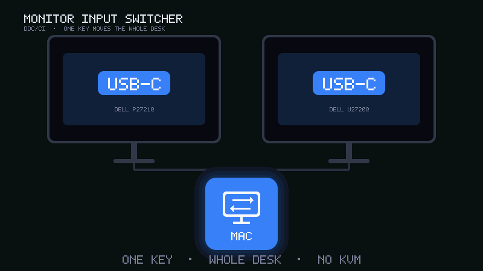

# Monitor Input Switcher



Switch monitor inputs on Windows using DDC/CI. Configure per-monitor hotkeys, toggle between two inputs (DisplayPort, USB-C, HDMI, etc.), or switch a whole desk between two PCs with one shortcut.

> macOS build lives in [`macos/`](macos/README.md), and ships an [Elgato Stream Deck plugin](macos/README.md#stream-deck) for switching from a key.

## Download (recommended)

1. Open **[Releases](https://github.com/Dor-Peretz/monitor-input-switcher/releases)** and download `MonitorInputSwitcher.exe` (or the `.zip`).
2. Run `MonitorInputSwitcher.exe` — it starts in the system tray.
3. **Double-click** the tray icon to open settings and configure your monitors.
4. On first run, settings are saved to `%APPDATA%\MonitorInputSwitcher\config.json`.

> Windows SmartScreen may warn on first run because the app is not code-signed. Click **More info → Run anyway**, or build from source below.

## Requirements

- Windows 10/11
- DDC/CI enabled in each monitor's OSD menu
- For source installs: Python 3.10+

## Quick start (installed app)

Run `MonitorInputSwitcher.exe`. The app:

- Starts in the **system tray** (look for the `^` arrow near the clock)
- Enables **startup on login** automatically on first run
- **Double-click** tray icon → settings UI
- **Right-click** tray icon → reload hotkeys, startup toggle, about, exit

Settings and state are stored in:

```
%APPDATA%\MonitorInputSwitcher\
  config.json
  switcher_state.json
  tray.log
```

## Quick start (from source)

```powershell
git clone https://github.com/Dor-Peretz/monitor-input-switcher.git
cd monitor-input-switcher
pip install -r requirements.txt
py -3 main.py
```

Or use the helper scripts:

```powershell
py -3 launch_tray.py    # tray app (background)
py -3 ui.py             # settings UI
```

**CLI** (source install):

```powershell
py -3 monitor_switcher.py list
py -3 monitor_switcher.py toggle --monitor right --inputs 0x0F 0x1B
py -3 monitor_switcher.py run
```

## Configuration

Settings are edited through the UI and saved to `config.json`.

### Per monitor

Each row defines a hotkey that toggles one monitor between **Input A** and **Input B**.

### PC switch (group)

Define two PC profiles (e.g. Laptop / Desktop). For each monitor, set which input belongs to PC A and PC B. One hotkey switches every included monitor to the other PC.

Example input codes:

| Input        | Code (decimal) | Code (hex) |
|-------------|----------------|------------|
| DisplayPort-1 | 15           | 0x0F       |
| HDMI-1      | 17             | 0x11       |
| USB-C       | 27             | 0x1B       |

Codes vary by monitor brand — use trial and error if needed.

See `config.example.json` for the default structure.

## Build from source

```powershell
pip install -r requirements.txt -r requirements-build.txt
.\scripts\build.ps1
```

Output:

- `dist\MonitorInputSwitcher.exe`
- `dist\MonitorInputSwitcher-v1.0.0-win64.zip`

## Publish a new release

1. Bump `__version__` in `version.py` and `version_info.txt`.
2. Commit and push to `main`.
3. Create and push a tag:

```powershell
git tag v1.0.0
git push origin v1.0.0
```

GitHub Actions builds the `.exe`, zips it, and attaches both to a GitHub Release automatically.

## Project layout

| File | Purpose |
|------|---------|
| `main.py` | Unified entry point (tray, settings, CLI) |
| `tray_app.py` | Background tray app + hotkeys |
| `ui.py` | Configuration UI |
| `hotkey_service.py` | Global hotkey listener |
| `ddc_monitor.py` | DDC/CI monitor control |
| `config_store.py` | Config load/save |
| `monitor_switcher.py` | CLI entry point |
| `monitor_input_switcher.spec` | PyInstaller build spec |

## Notes

- DDC/CI commands only work over the **active** input cable. To switch back from USB-C, the app must run on the machine that is currently connected to the monitor.
- If the tray icon is hidden, click the `^` arrow near the clock and look for **Monitor Input Switcher**. You can pin it in **Settings → Personalization → Taskbar → Other system tray icons**.

## License

MIT — see [LICENSE](LICENSE).
